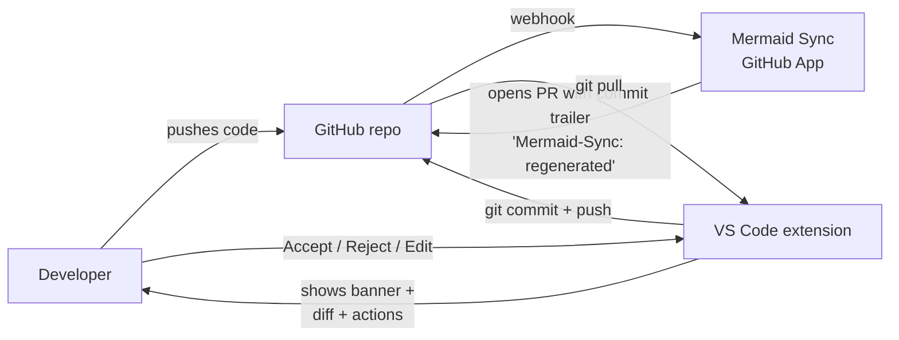

# Bot edits Mermaid diagrams. Humans review them. Right inside the IDE.

## Why now

PwC named auto-sync as their #1 ask. The Mermaid Sync GitHub App ships
that — it regenerates `.mmd` files when code changes and opens a PR.
**The plugin completes the loop** by turning that PR into a glance-able
review, where the developer already lives: their editor.

> Strategic role: this is the *retention* slice. Auto-sync gets users in;
> in-IDE review is what makes them stay.

---

## The user moment, in one paragraph

A developer pulls a branch. They open a `.mmd` file the bot edited. A
single line at the top says **"Synced by Mermaid Sync · `b242285` —
Review"** with three actions next to it: **Accept · Reject · Edit**. One
click reveals a side-by-side: source diff on the left, before/after
diagram previews on the right with the new node tinted green. They decide
in seconds. They commit. Done.

No webhook tab. No PR comment thread. No "wait, what changed?"

---

## End-to-end flow

The bot and the extension never talk directly. **Their only contract is a
commit-message trailer.** That's what makes the system loosely coupled —
either side can change without breaking the other.

---

## What each persona sees

| Persona | Sees | Decides |
|---|---|---|
| **Repo admin** | A GitHub App to install once, plus optional `.mermaidignore` and `.smart-mermaid-updates.yml` | Where the bot may edit |
| **Developer** | Banner + Accept/Reject/Edit at top of the `.mmd` file. Side-by-side diff on click. Tinted green node where the bot added something. | Whether the bot got it right |
| **Reviewer on GitHub** | The PR appears reviewed once the developer Accepts | Approve or request changes |

A Mermaid Chart account is **not** required for PR Review. Only the
extension and a GitHub repo are. (The cloud diagram library, AI
suggestions, and existing diagram management features still need
sign-in.)

---

## How it monetizes

The honest part first: **PR Review on its own does not directly
monetize.** It runs on local Git, no Mermaid account required, no
server-side cost to meter. So the monetization model is *adjacent*: PR
Review is the wedge that makes paid surfaces obvious.

### The model in one sentence

> The plugin and the review experience are **free forever**. The
> **GitHub App** carries the org-level paywall, and the **logged-in
> extras** in the review surface make the value of an account visible
> *at the moment of review*.

### Why we don't gate the review action itself

The first thing we considered was: gate Accept/Reject behind sign-in.
Don't. The user has just decided — putting a paywall at the moment of
value generates support tickets, not signups. Instead, **make the
account visible as a carrot**: the review surface always shows a
"Connected to your library" row. Signed-out users see a soft sign-in
prompt in that same real estate. Signed-in users see the badges. **Same
pixels, two states** — the locked state advertises the upside.

### What the buyer sees today

All five paid surfaces are visible in the product as locked-but-clickable
affordances — same vertical real estate either way:

| Where | Feature | Tier | Click → |
|---|---|---|---|
| Review surface — extras row | Engineering Docs library | Sign-in | Sign-in modal |
| Review surface — extras row | Comments | Team | Trial modal |
| Review surface — extras row | Logged review history | Team | Trial modal |
| Review surface — extras row | AI edit | Pro | Waitlist modal |
| Mermaid Sync activity-bar | Multi-diagram review + Bulk accept | Pro | Trial modal |

Each modal carries `[Sign in | Start trial | Join waitlist]` and
`[Learn more]` buttons; "Learn more" deep-links to the pricing page.
Analytics events track every click so click-through interest per feature
becomes legible the moment the surface ships.

### Where the real money comes from

For the PwC-class customer that named auto-sync as their #1 ask, the
sale is **the GitHub App on their org**. Per-seat plugin upgrades are a
secondary revenue line. PR Review is the *demo that wins the org sale*
— it's the first time a developer in that org sees the system close the
loop, and once they do, the value of the paid app becomes legible to
the buyer.

This reframes the strategy doc: PR Review is **not where money comes
from**; it's the surface where the value of the **paid systems**
becomes obvious to the developer who would otherwise never see them.

---

## What's shipped vs. what's next

| Slice | Status | What it delivers |
|---|---|---|
| 0 — Detection | ✅ Q2 | Reads the bot trailer from local Git history |
| 1 — Banner + tab dot | ✅ Q2 | Passive surface that says "something changed here" |
| 2 — Side-by-side diff + actions | ✅ Q2 | The thesis-proving review experience |
| 3 — Multi-diagram PR sidebar | Q3 | Pending-review list when a PR touches many `.mmd` files |
| 4 — Removals, renames, restructures | Q3 | Genuinely novel design surface; ghost nodes, rename diff |
| 5 — Edit mode | Q3 | Three-state edit (original / draft / saved) per the mockup |
| 6 — Config file UX | Q3 | Visual editor for `.mermaidignore` and rule files |
| 7 — Pre-emptive local sync | Q4 | Run regen locally before opening the PR — needs Mermaid auth |

---

## Three design principles guiding every slice

1. **Acknowledgement before action.** The first thing a user sees is "the
   bot did this" — not a UI asking them to do something. We earn the
   right to ask for a decision by first making the change legible.

2. **Native VS Code surfaces, not chrome.** Banner is a CodeLens. Tab
   indicator is a `FileDecoration`. Diff is `vscode.diff`. Anything that
   feels like our own UI panel — we lose users who think it's a marketing
   surface, not a tool.

3. **Loose coupling at the seams.** Bot → Git trailer → extension. No
   shared APIs, no auth handshake, no synchronous dependency. If the bot
   pauses or the extension is offline, neither breaks.

---

## Open questions for the team

- Should "Reject" auto-create a `git revert` commit, or land in a draft
  the dev refines? (Currently: writes parent content to working tree, dev
  commits manually.)
- For Slice 3, is the multi-diagram list rendered in the editor area or
  as a sidebar view? Mockup leans sidebar.
- For Slice 5, can the standard Mermaid editor host a "draft mode" banner
  without forking the editor component?
